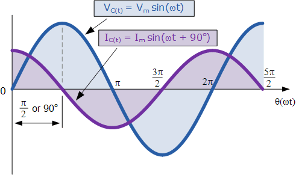

## Simulator to understand impedance spectroscopy

This website provides an interactive simulation designed to explain 
electrochemical impedance spectroscopy (EIS) by analogy with water flow through pipes.
The simulation can be accessed [here](./interactive_impedance.html).

This project was developed at the University of Edinburgh to assist with teaching impedance spectroscopy as part of
chemistry courses in solid state materials chemistry, with a focus on battery materials.
It is released as a freely available open educational resource for use in other disciplines, however.

This project is made freely available under a CC-BY license. If you use 
this project or any of the code within it, please cite this original work!

## Electrochemical Impedance Background

### Electrical conduction

Many materials conduct electricity, for instance metals like copper or iron. How well a material
conducts electricity can be quantified by its resistance[^1], or how well it opposes the flow of charge.
The electrical current ($I$, in amps) flowing through a material is related to this resistance ($R$, in ohms) through 
the relatively simple "Ohm's law":

$$
I = \frac{V}{R}
$$

Here, $V$ is the voltage (measured in volts) across the material. For now, we can think of voltage as
the 'driving force' or 'pressure' causing the flow of current.

Although we tend to think of metals when we talk about electrical conductivity[^2], we can (in principle) measure
the resistance of anything; wood, water, silicon...! Those materials with higher resistance are typically classed
as semiconductors or insulators. While they are terrible for making wires to plug in toasters, these materials are 
very important; semiconductors form the basis of all computers, while insulators are important to make sure electrical
current goes where we want it to safely.

### Impedance

Measuring the resistance of a material when applying a constant voltage is useful, but only gives one number. While useful,
this doesn't give us much information to work out what is happen at a microscopic level during electronic conduction. 
For example, imagine a material where the charge carriers (e.g. electrons) could only move a short distance before they
stop due to an obstruction or some other reason.[^3] When you first apply a voltage to this material the electrons will move
(creating a current), but when they hit the obstruction this movement will cease (i.e. the current will become zero). Experimentally,
it is actually very difficult to measure the initial motion, so this material would probably appear to have a very high resistance.

The solution to this problem is to change the direction of the voltage *before* the electron hits the obstruction. This way, 
we will measure the motion of the electron without the obstruction, giving a low resistance. This is known as an "alternating current"
(AC) technique, where we apply a sinusoidal voltage, and measure the resulting sinusoidal current. 

Thinking more about this, the resistance must depend on how fast (the frequency) we change the direction of the voltage; at high
frequencies the electron never has time to hit the obstruction, so we just measure the resistance of the moving electron. At very low frequencies
(in the extreme this is not changing direction at all) the electrons will hit the obstruction and give a very high resistance. Somewhere
in the middle, we should see a combination of both processes occurring. Clearly, by applying a varying voltage at different frequencies we
can learn quite a lot about what happens in our material.

Fortunately, we can extend Ohm's law to account for this AC technique. Here, we call the resistance an impedance, $Z$ which depends on the 
frequency of the voltage change ($\omega$).[^4] Because $V$ and $I$ now vary with time ($t$), the exact value they take depends on the time 
at which they are measured.

$$
I_t = \frac{V_t}{Z(\omega)}
$$

Because we apply a voltage of the form
$$
V_t = V_0 \sin(\omega t)
$$
our current $I$ must also be sinusoidal. 

**Note, though, that the current doesn't necessarily have to change direction at the same time
as the voltage!**

This is a tricky concept, but a helpful analogy is to think of momentum. Imagine a spacecraft approaching a 
distant planet very fast, but aiming to land on the surface. When the 'retro-rockets' start the spacecraft doesn't
immediately stop; it takes a while after the force starts before the existing momentum is reduced to zero (and ideally, this occurs
on the surface of the planet!). In this analogy, the spacecraft is the current and the retro-rockets are the voltage; even 
though the voltage has changed direction, it takes a while for the current to change too.

To express this mathematically, the current $I$ can have a phase offset $\phi$ from the voltage:

$$
I_t = I_0 \sin (\omega t + \phi)
$$

Combining these different expressions, the overall impedance has both a magnitude $(|Z|)$ and phase $(\phi)$, which need to be considered separately.
Different plots of frequency, $|Z|$ and $\phi$ can be used to understand different features:
- Bode plot: Plots $\|Z\|$ and $\phi$ versus frequency $\omega$
- Nyquist plot: shows $Z$ at each frequency as a point on an Argand diagram, but ignores explicit frequency information

These plots and the underlying $V_t$ and $I_t$ curves are shown in [the simulation](./interactive_impedance.html)

### The simulation

In impedance spectroscopy, we commonly model real materials as a combination of resistors and capacitors. The impedance of these is described below:

- Resistors (R): $\|Z\|$ is independent of frequency, and current changes at the same time as voltage ($\phi=0$)
- Capacitors (C): Impedance increases with decreasing frequency, such that $|Z| = -\frac{1}{\omega C}$ (where $C$ is the capacitance in Farads). At all frequencies, the current is perfectly out of phase with the voltage ($\phi=+90$).

The exact combination of R and C components in our model can be used to understand the underlying behaviour; resistive contributions means that something is prevent the current from flowing freely, 
for instance ions can only diffuse slowly or there is only a small part of the sample that can conduct easily. Capacitive components are a sign that charge is being built up; often this is where charge carriers
are hitting a barrier which causes them to 'back up', but it can also arise from interactions between different atoms in a material.

The simulation aims to express this in analogy with water flow through pipes. A simple resistance is like a constriction in the pipe which slows the flow of water; the higher the resistance, the smaller the hole.
A capacitor is like a "flexible blockage" (e.g. a rubber plate); water cannot pass through it, but the force of water against it causes it to move, which then pushes water the other side of the blockage.
The size of the capacitance can be viewed as how 'stretchy' the blockage is, i.e. how easily can it displace without being pulled back towards the middle. 
A common model used in materials electrochemistry is a 'parallel-RC' circuit, where electrical flow and charge build-up occur at the same time. In this analogy, this is like a rubber blockage with a 
hole in it!

### Next steps

Now you understand the basics of impedance, try out [the simulation](./interactive_impedance.html)! Explore how the force applied on one side of the water (purple arrow) affects the resulting movement on
the other end of the pipe (pink arrow). Play around with the frequency, resistance and capacitance values to see what the effect is.

**Challenge**: using the parallel-RC circuit, see if you can generate a semicircle in the Nyquist plot; this is a common feature in materials electrochemistry!

If you have any comments on this simulation, please get in touch with me at james.cumby@ed.ac.uk.

## Notes

[^1]: Note that resistance (and impedance) depends on how much material you have; a 3 cm long wire has 10,000 times less resistance than a 3 km long wire! To get round this, materials scientists refer to the 'resistivity' of a material, which is independent of how much of it there is. In this tutorial, we are ignoring this difference for simplicity.
[^2]: Conductivity is the inverse of resistivity, i.e. a higher resistivity gives a lower conductivity.
[^3]: This is not as crazy as it seems; electrons are typically 'bound' to atoms, and although they can slosh around a bit, they often cannot escape the atom completely.
[^4]: Here we are using angular frequency to simplify things, but it is related to the frequency $f$ (in Hz) by $\omega = 2\pi f$.